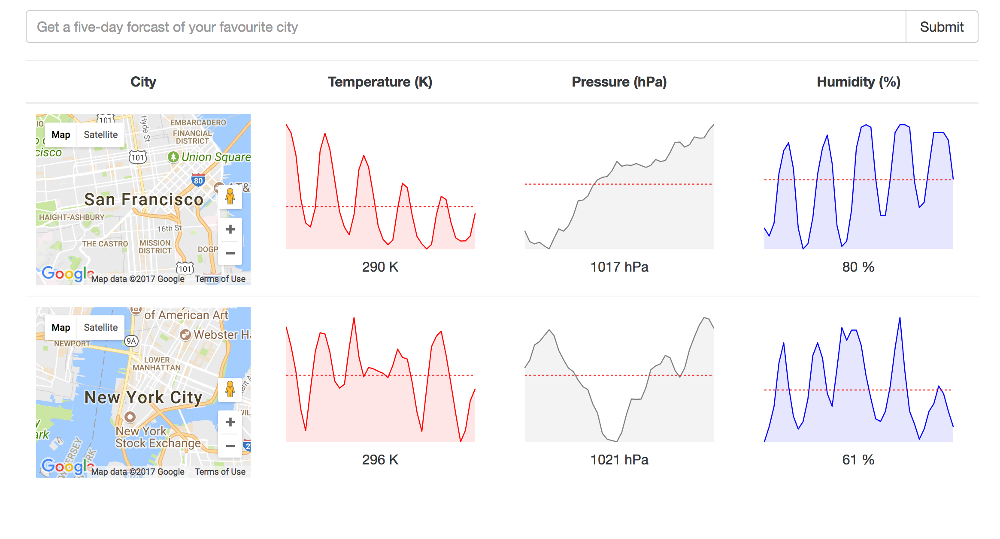

# Weather App
An app that displays the weather of a city (cities) that is queried.



### Installation
Checkout this repo, install dependencies, then start the gulp process with the following:

```
> git clone https://github.com/LawynnJana/weather-app.git
> cd weather-app
> npm install
> npm start
```
Open a broswer and enter localhost:8080 in the address bar.
Query a city which will be appended to a list of displayed cities.
Each city has a map and its weather (temperature, humidity, pressure) displayed in charts.
